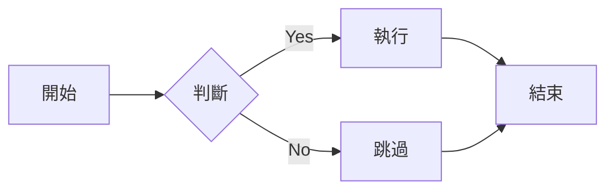
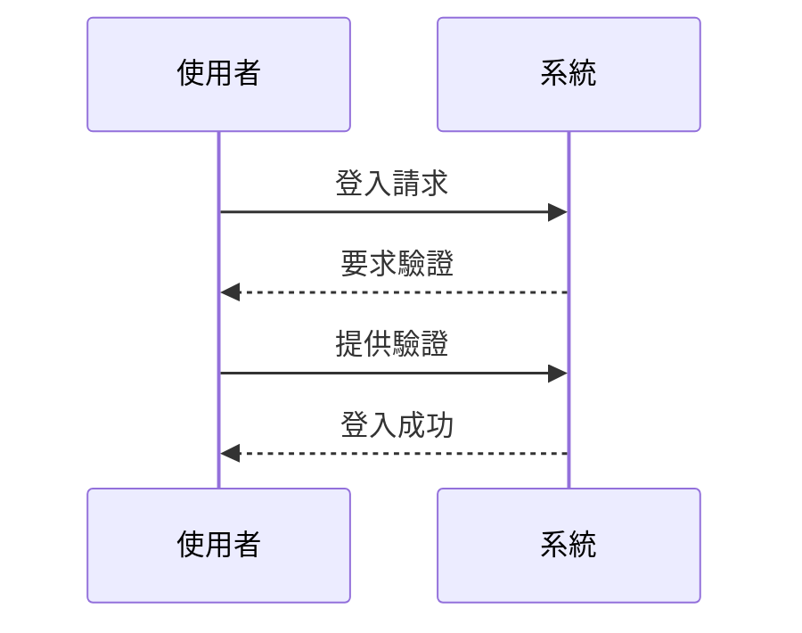

# Material for MkDocs 功能展示

本文將展示 Material for MkDocs 提供的各種 Markdown 擴展功能。

<!-- more -->

## Data Tables

使用標準的 Markdown 表格語法：

| 功能     | 支援度 | 說明                 |
|----------|:------:|---------------------|
| 表格     | ★★★★★ | 完整支援             |
| 對齊     | ★★★★☆ | 支援左中右對齊       |
| 格式化   | ★★★★☆ | 支援大部分格式化語法 |

## Diagrams

使用 Mermaid 繪製流程圖：

使用 Mermaid 繪製時序圖：

## Grids

使用 CSS Grid 創建網格布局：

- :fontawesome-brands-html5: __HTML__
    
    HTML 是網頁的基礎結構
    
    [:octicons-arrow-right-24: 了解更多](#)

- :fontawesome-brands-css3: __CSS__
    
    CSS 用於網頁樣式設計
    
    [:octicons-arrow-right-24: 了解更多](#)

- :fontawesome-brands-js: __JavaScript__
    
    JavaScript 用於網頁互動
    
    [:octicons-arrow-right-24: 了解更多](#)

## Icons

Material for MkDocs 支援多種圖示：

- :material-account-circle: – 使用者
- :material-check-circle: – 成功
- :material-close-circle: – 失敗
- :fontawesome-regular-face-laugh: – 表情
- :octicons-heart-fill-24: – 愛心

## Emojis

也支援標準的 Emoji：

- 👋 打招呼
- 🎉 慶祝
- 💡 想法
- 🚀 發布
- 🔧 設定

## Images

圖片支援多種格式和對齊方式：

{: align=center }

支援圖片註解：

<figure markdown>
  { width="300" }
  <figcaption>圖片說明文字</figcaption>
</figure>

## Lists

### 無序列表

- 第一項
    * 子項目 A
    * 子項目 B
- 第二項
    * 子項目 C
    * 子項目 D

### 有序列表

1. 第一步
    1. 子步驟 1
    2. 子步驟 2
2. 第二步
    1. 子步驟 3
    2. 子步驟 4

### 任務列表

- [x] 完成的任務
- [ ] 未完成的任務
    - [x] 子任務 A
    - [ ] 子任務 B

### 定義列表

`Markdown`
:   一種輕量級標記語言

`MkDocs`
:   一個靜態網站生成器
