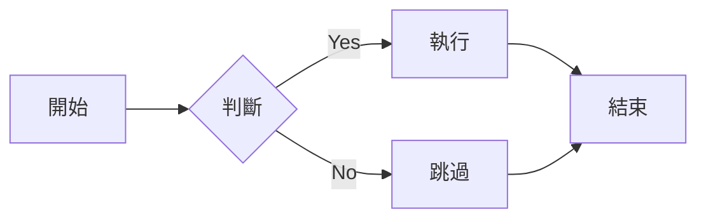
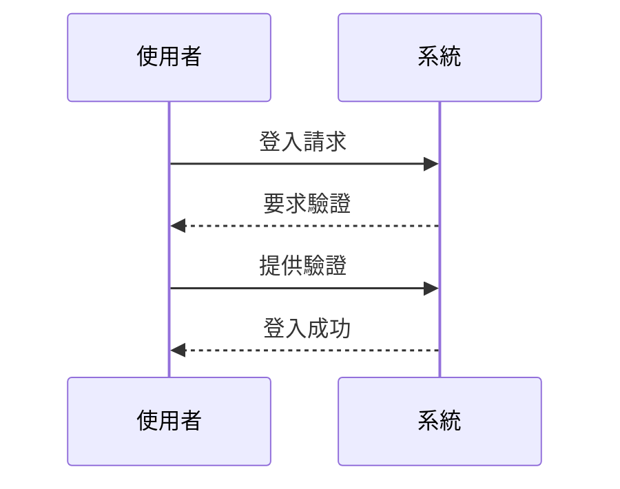

# Material for MkDocs 功能展示

本文將展示 Material for MkDocs 提供的各種 Markdown 擴展功能。

<!-- more -->

## Diagrams

使用 Mermaid 繪製流程圖：



使用 Mermaid 繪製時序圖：



## Button

[Subscribe to our newsletter](#){ .md-button }

## Grids

使用 CSS Grid 創建網格布局，Grid 常用於卡片式內容、產品展示、團隊介紹等場景。以下展示幾種常見用法：

### 基本卡片展示

#### card grid

<div class="grid cards" markdown>

- :fontawesome-brands-html5: **HTML** for content and structure
- :fontawesome-brands-js: **JavaScript** for interactivity
- :fontawesome-brands-css3: **CSS** for text running out of boxes
- :fontawesome-brands-internet-explorer: **Internet Explorer** ... huh?

</div>


#### Card grid, complex example.

<div class="grid cards" markdown>

-   :material-clock-fast:{ .lg .middle } __Set up in 5 minutes__

    ---

    Install [`mkdocs-material`](#) with [`pip`](#) and get up
    and running in minutes

    [:octicons-arrow-right-24: Getting started](#)

-   :fontawesome-brands-markdown:{ .lg .middle } __It's just Markdown__

    ---

    Focus on your content and generate a responsive and searchable static site

    [:octicons-arrow-right-24: Reference](#)

-   :material-format-font:{ .lg .middle } __Made to measure__

    ---

    Change the colors, fonts, language, icons, logo and more with a few lines

    [:octicons-arrow-right-24: Customization](#)

-   :material-scale-balance:{ .lg .middle } __Open Source, MIT__

    ---

    Material for MkDocs is licensed under MIT and available on [GitHub]

    [:octicons-arrow-right-24: License](#)

</div>


#### Generic grid

<div class="grid" markdown>

=== "Unordered list"

    * Sed sagittis eleifend rutrum
    * Donec vitae suscipit est
    * Nulla tempor lobortis orci

=== "Ordered list"

    1. Sed sagittis eleifend rutrum
    2. Donec vitae suscipit est
    3. Nulla tempor lobortis orci

``` title="Content tabs"
=== "Unordered list"

    * Sed sagittis eleifend rutrum
    * Donec vitae suscipit est
    * Nulla tempor lobortis orci

=== "Ordered list"

    1. Sed sagittis eleifend rutrum
    2. Donec vitae suscipit est
    3. Nulla tempor lobortis orci
```

</div>


### 產品功能展示

<div class="grid" markdown>
- [:material-speedometer: **高效能**](){ .md-button }
  優化的程式碼確保最佳效能表現
- [:material-shield: **安全性**](){ .md-button }
  內建多重安全防護機制
- [:material-responsive: **響應式**](){ .md-button }
  完美支援各種裝置尺寸
- [:material-cog: **可擴展**](){ .md-button }
  模組化設計，易於擴充功能

</div>

### 團隊成員展示

<div class="grid cards" markdown>

-  { align=left }

    **John Doe**

    技術總監

    [:material-email: Email](#)

-  { align=left }

    **Jane Smith**

    產品經理

    [:material-email: Email](#)

</div>

### 服務項目展示

<div class="grid cards" markdown>
- :material-web: **網站開發**

    - 響應式設計
    - SEO 優化
    - 效能調校
    [:octicons-arrow-right-24: 詳細資訊](#)

- :material-mobile: **APP 開發**

    - iOS/Android
    - 跨平台解決方案
    - UI/UX 設計
    [:octicons-arrow-right-24: 詳細資訊](#)

- :material-cloud: **雲端服務**

    - 伺服器管理
    - 資料備份
    - 系統監控
    [:octicons-arrow-right-24: 詳細資訊](#)

</div>

## Icons

Material for MkDocs 支援多種圖示：

- :material-account-circle: – 使用者
- :material-check-circle: – 成功
- :material-close-circle: – 失敗
- :fontawesome-regular-face-laugh: – 表情
- :octicons-heart-fill-24: – 愛心

## Emojis

也支援標準的 Emoji：

- 👋 打招呼
- 🎉 慶祝
- 💡 想法
- 🚀 發布
- 🔧 設定

## Images

圖片支援多種格式和對齊方式：
{: align=center }
支援圖片註解：

<figure markdown>
  { width="300" }
  <figcaption>圖片說明文字</figcaption>
</figure>

## Lists

### 無序列表

- 第一項

  - 子項目 A
  - 子項目 B

- 第二項
  - 子項目 C
  - 子項目 D

### 有序列表

1. 第一步

   1. 子步驟 1
   2. 子步驟 2

2. 第二步
   1. 子步驟 3
   2. 子步驟 4

### 任務列表

- [x] 完成的任務
- [ ] 未完成的任務
  - [x] 子任務 A
  - [ ] 子任務 B

### 定義列表

`Markdown`
: 一種輕量級標記語言

`MkDocs`
: 一個靜態網站生成器
