# mermaid語法展示流程圖

本文將展示Mermaid語法的使用方法。

<!-- more -->

## Diagrams

### 流程圖 (left - right)：

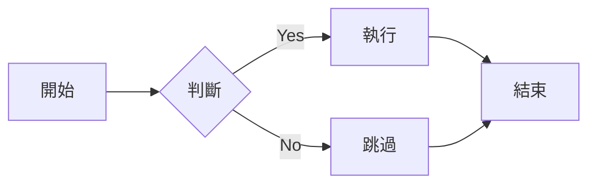

### 流程圖 (top - down)：

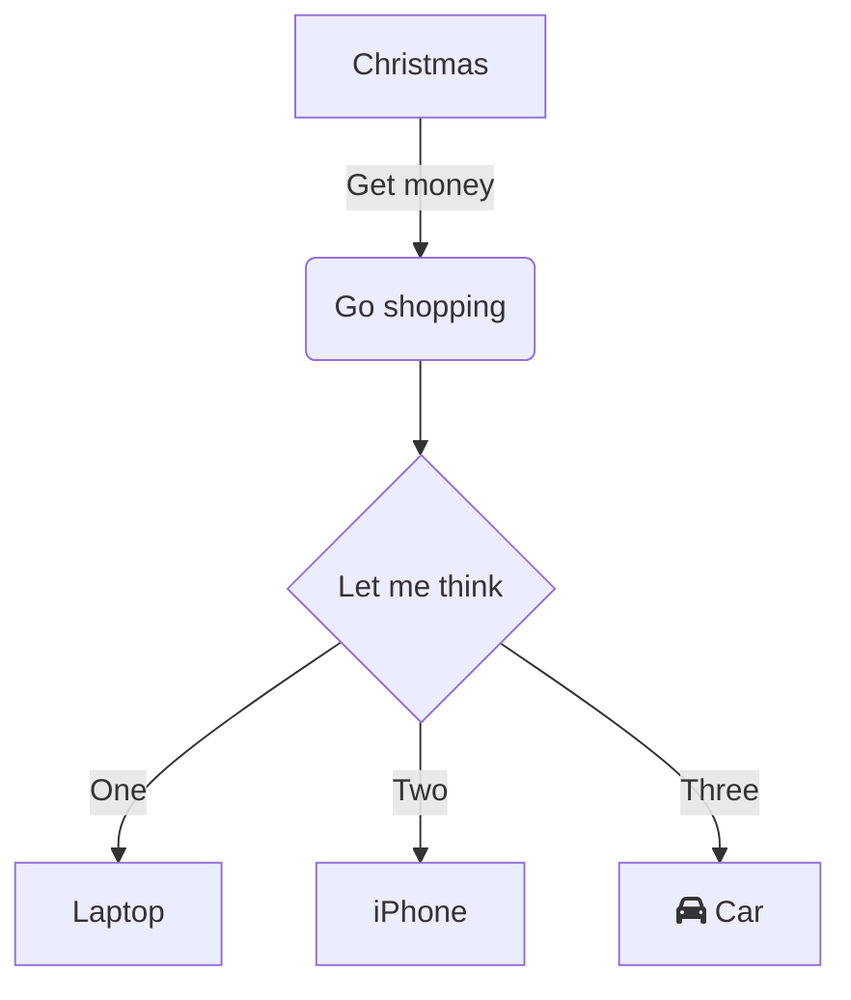

### 時序圖：

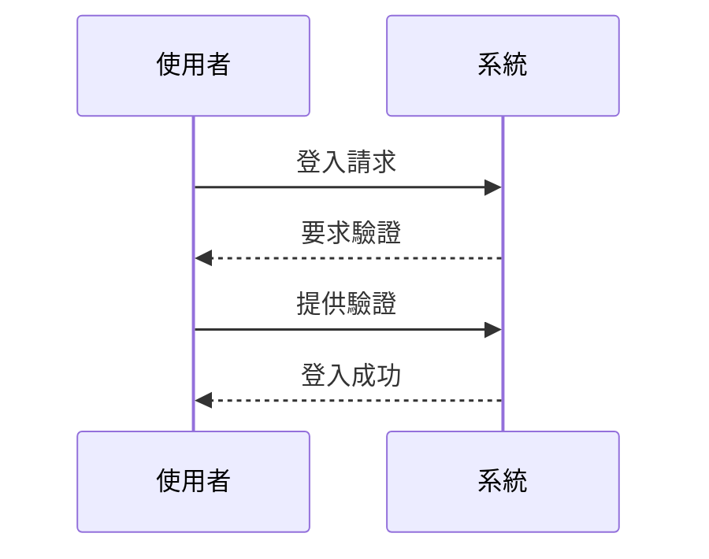

### 時序圖2：

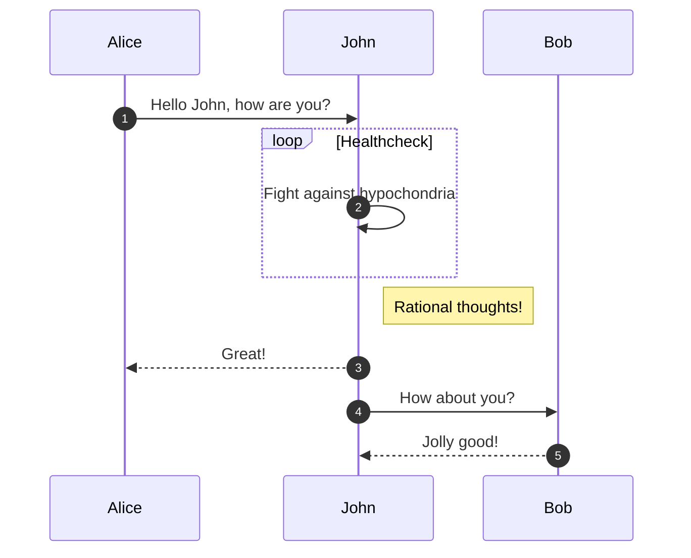

### 甘特圖：

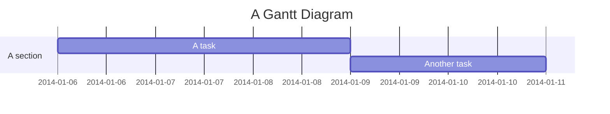

### 甘特圖2：

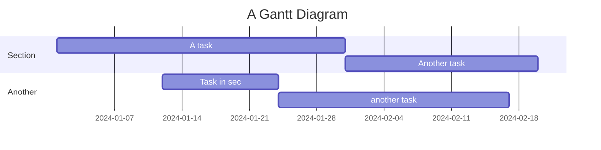

### 甘特圖3：

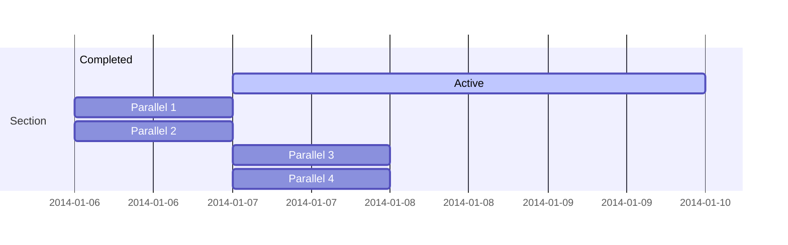

### 使用 Mermaid 繪製狀態圖：

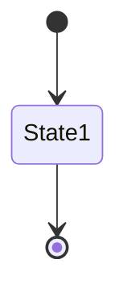

### 使用 Mermaid 繪製活動圖：

``` mermaid
activityDiagram
    title 簡單活動流程
    start
    :讀取資料;
    if (資料有效?) then (yes)
      :處理資料;
      :儲存結果;
    else (no)
      :記錄錯誤;
    endif
    stop
```

### 使用 Mermaid 繪製類別圖：

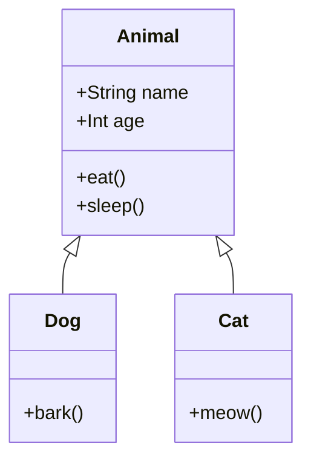

### 類別圖2

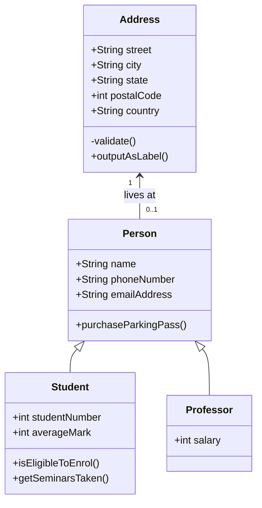

### entity-relationship diagram

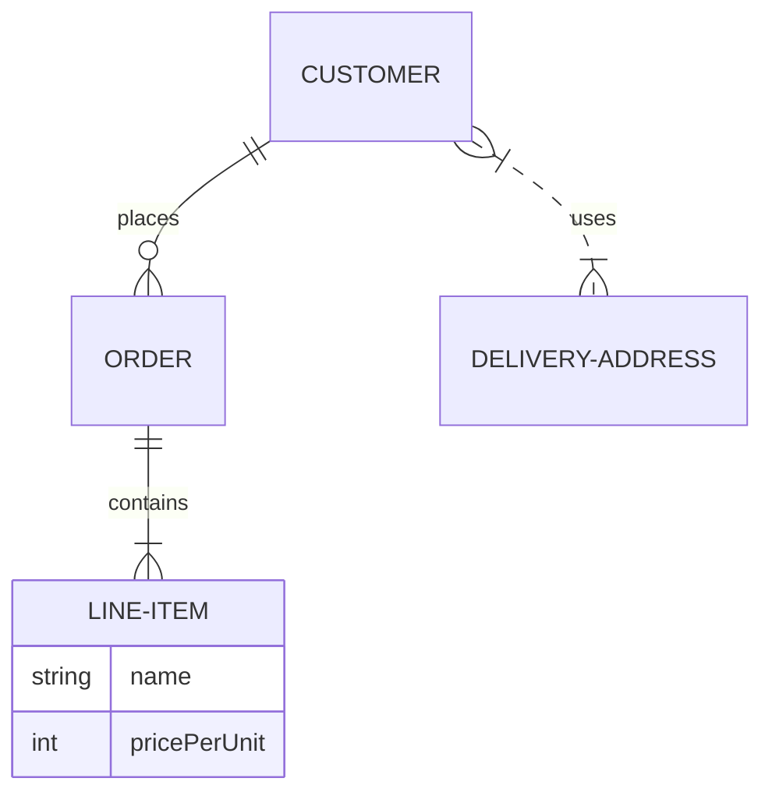

### 圓餅圖

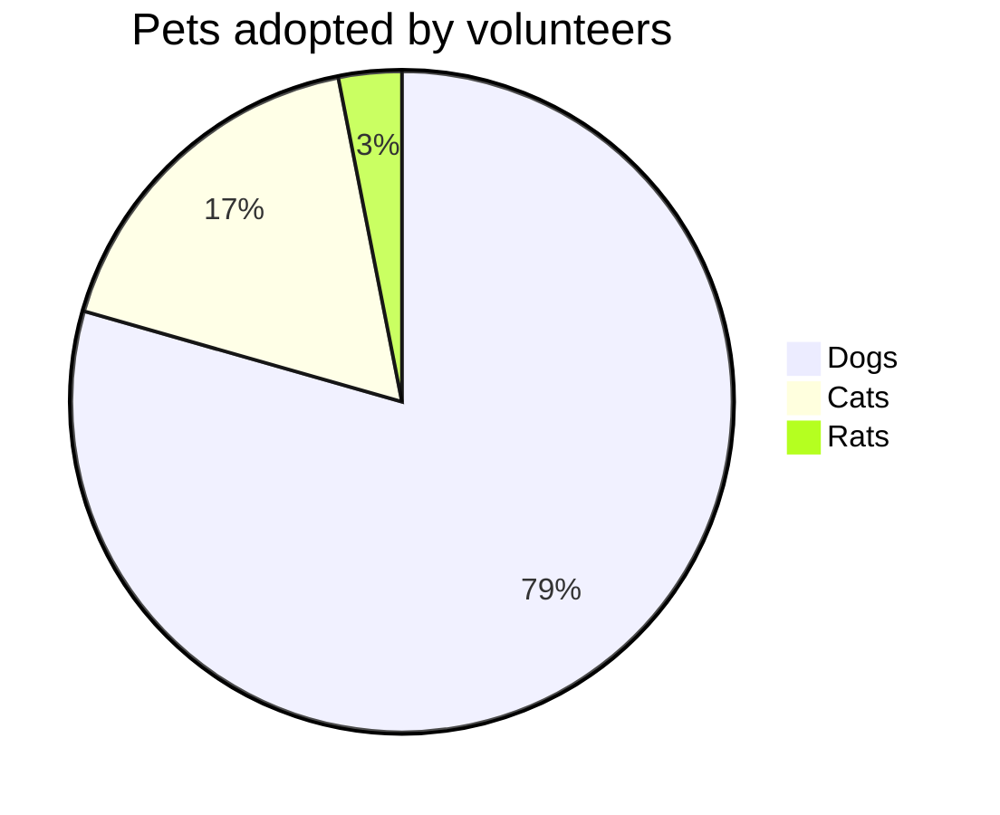
### 心智圖

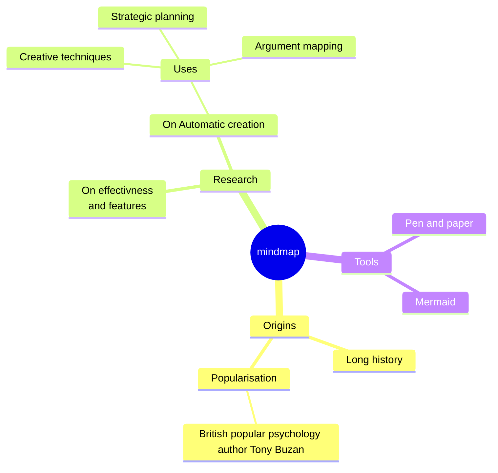

### 用戶旅程

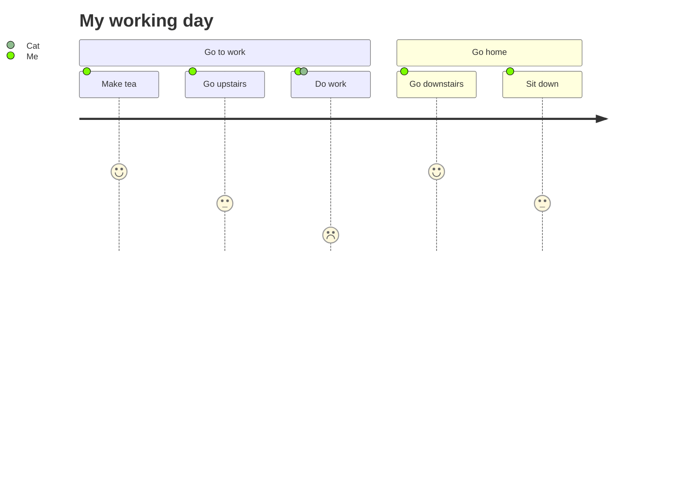