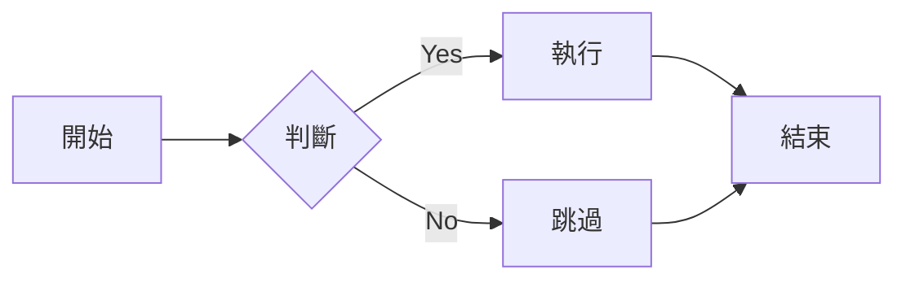
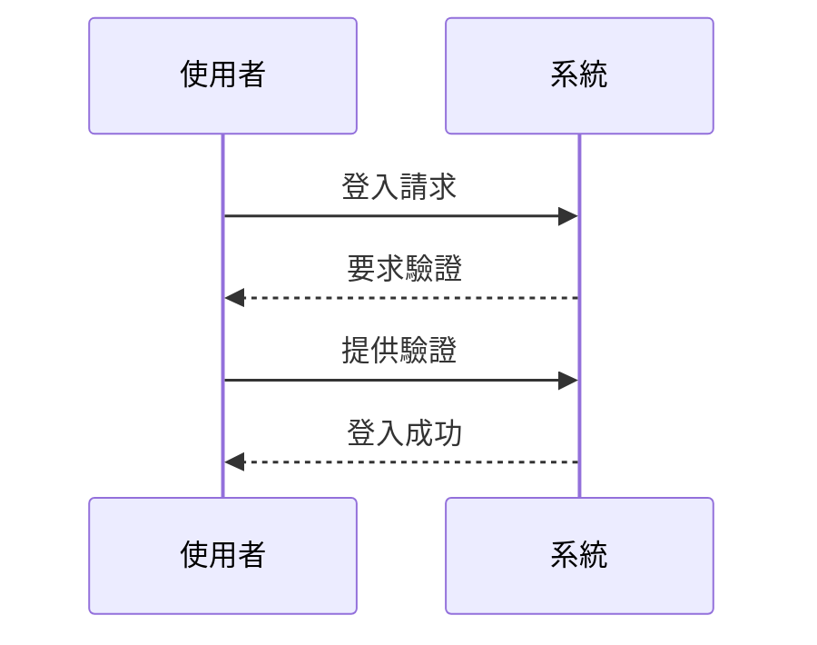

# mermaid語法展示流程圖

本文將展示Mermaid語法的使用方法。

<!-- more -->

## Diagrams

使用 Mermaid 繪製流程圖：

```mermaid
graph LR
    A[開始] --> B{判斷}
    B -->|Yes| C[執行]
    B -->|No| D[跳過]
    C --> E[結束]
    D --> E
```

使用 Mermaid 繪製時序圖：

```mermaid
sequenceDiagram
    participant 使用者
    participant 系統
    使用者->>系統: 登入請求
    系統-->>使用者: 要求驗證
    使用者->>系統: 提供驗證
    系統-->>使用者: 登入成功
```