# mermaid語法展示流程圖

本文將展示Mermaid語法的使用方法。

<!-- more -->

## Diagrams

### 流程圖 (left - right)：

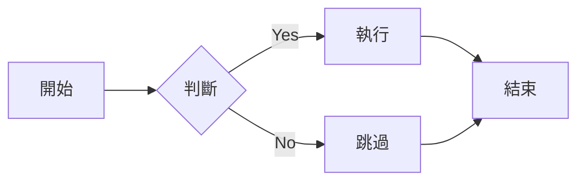

### 流程圖 (top - down)：

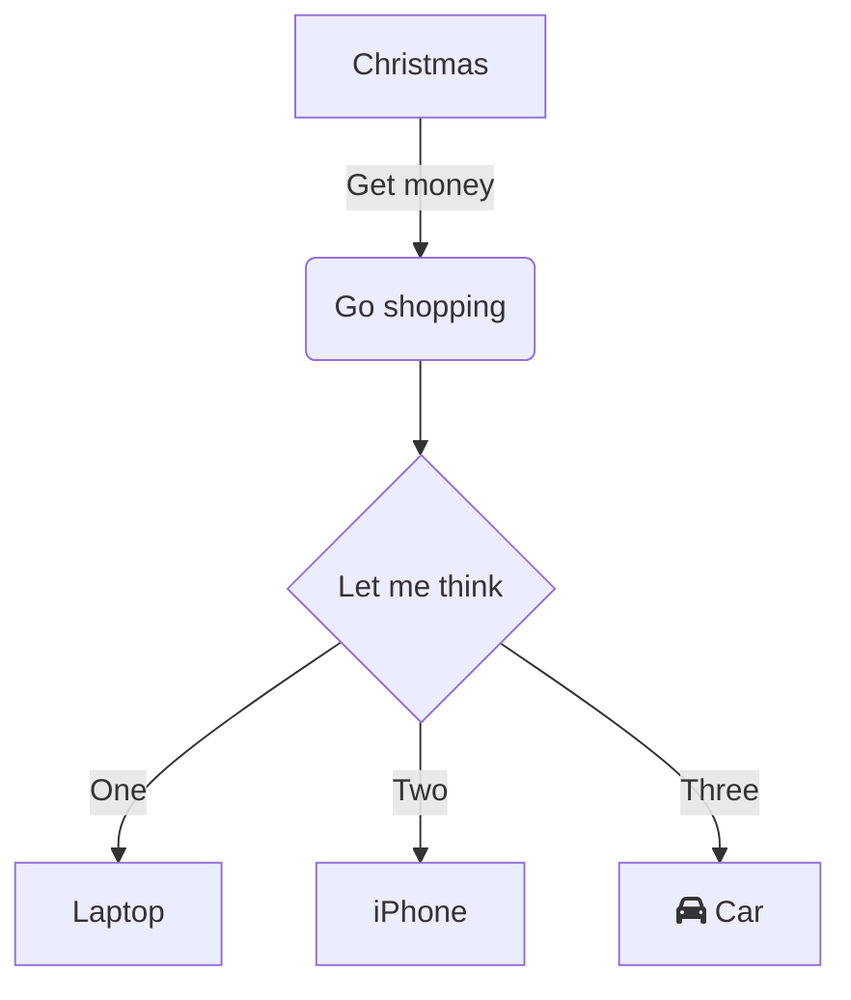

### 時序圖：

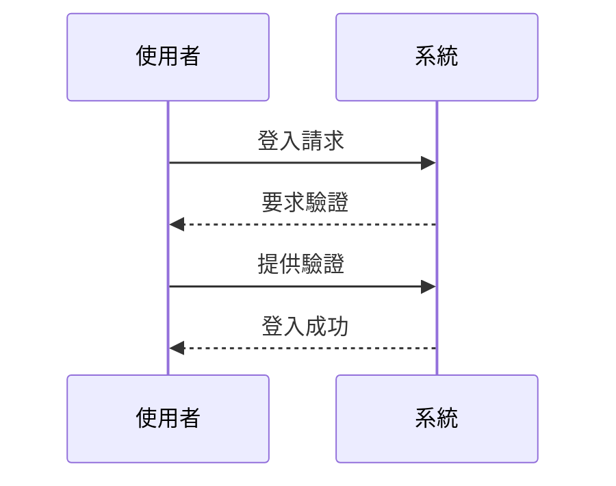

### 時序圖2：

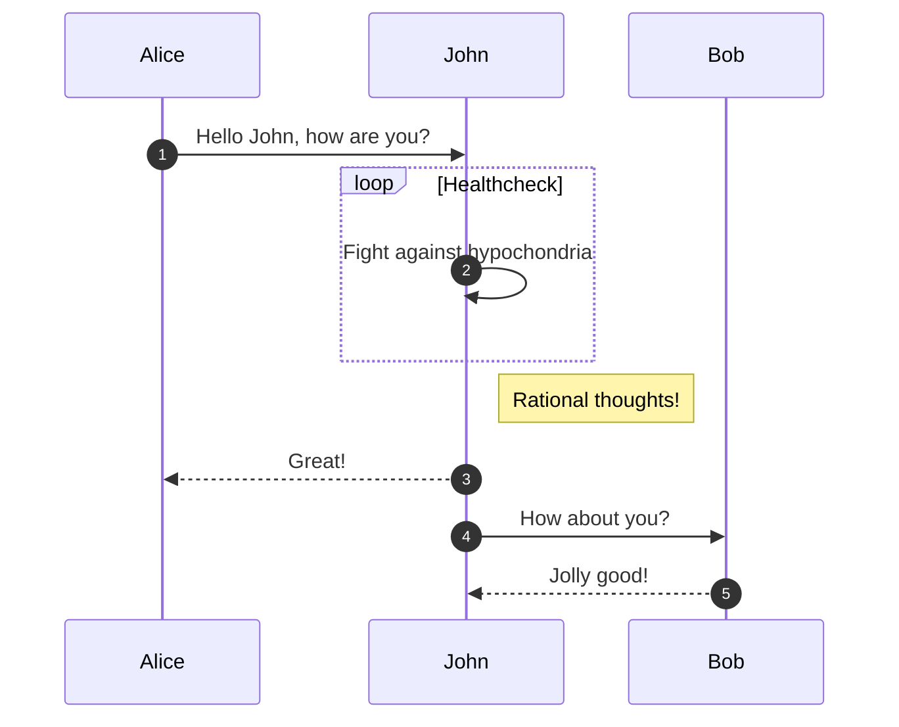

### 甘特圖：

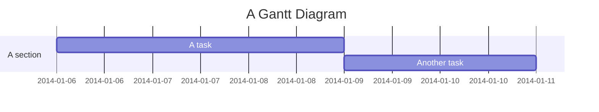

### 甘特圖2：

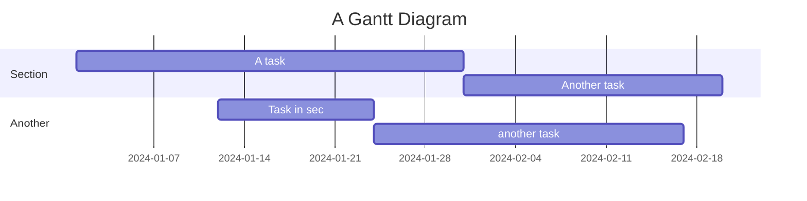

### 甘特圖3：

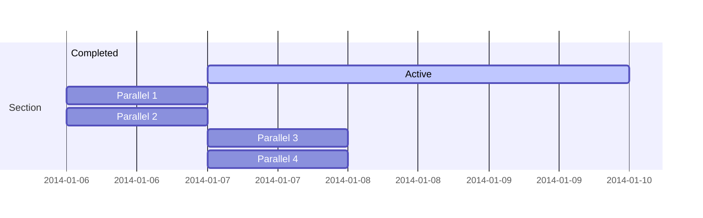

### 使用 Mermaid 繪製狀態圖：

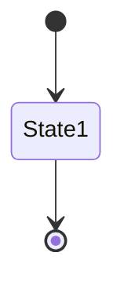

### 使用 Mermaid 繪製活動圖：

``` mermaid
activityDiagram
    title 簡單活動流程
    start
    :讀取資料;
    if (資料有效?) then (yes)
      :處理資料;
      :儲存結果;
    else (no)
      :記錄錯誤;
    endif
    stop
```

### 使用 Mermaid 繪製類別圖：

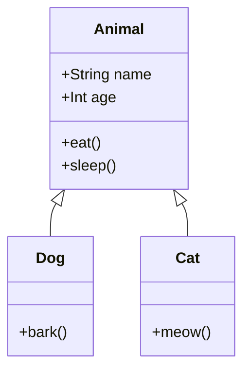

### 類別圖2

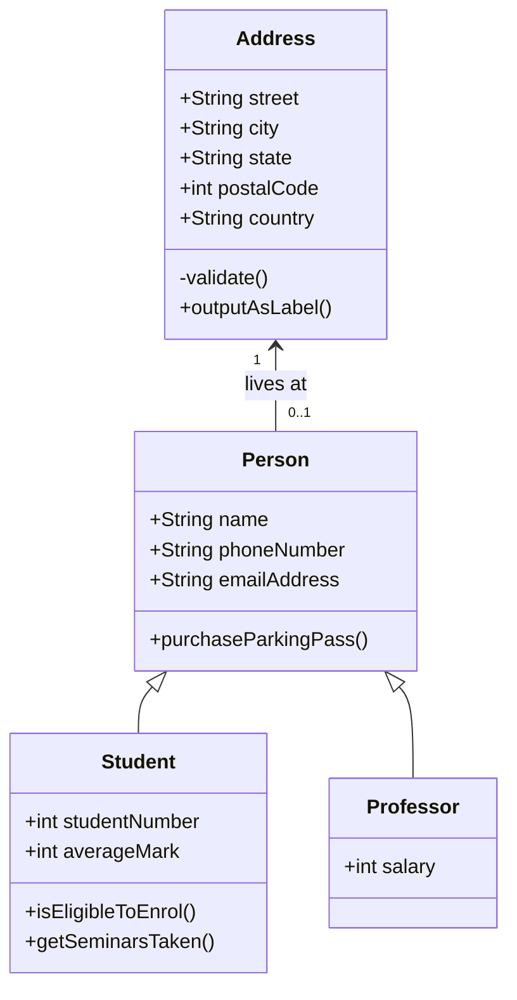

### entity-relationship diagram

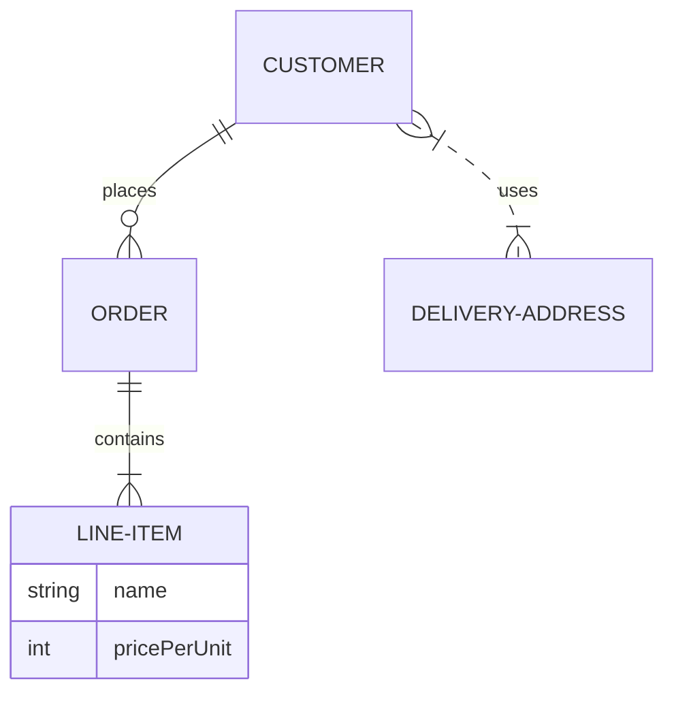

### 圓餅圖

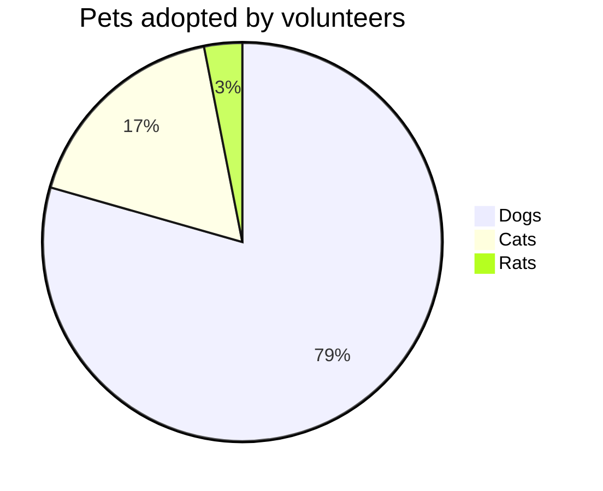
### 心智圖

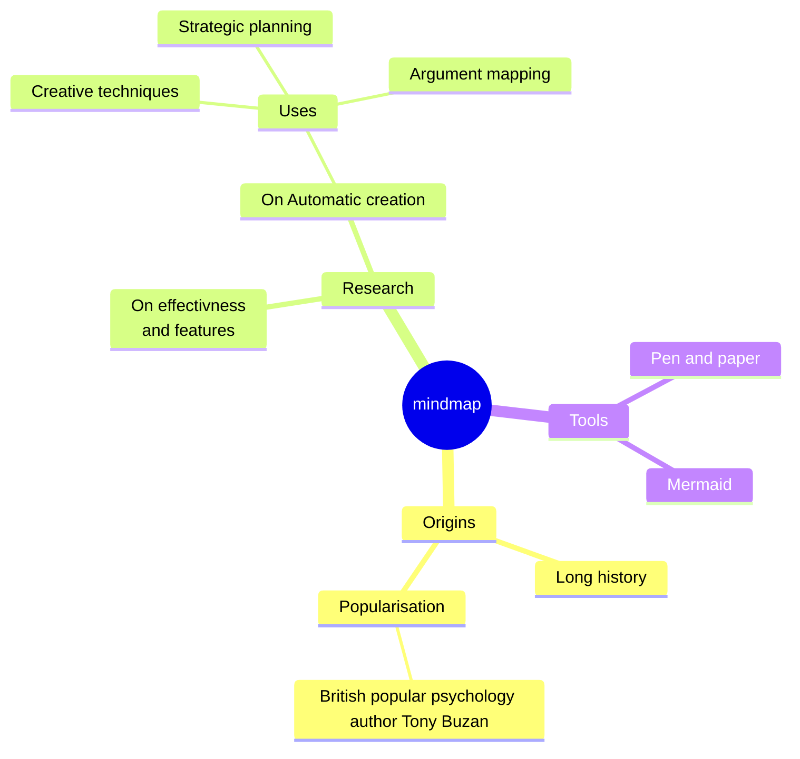

### 用戶旅程

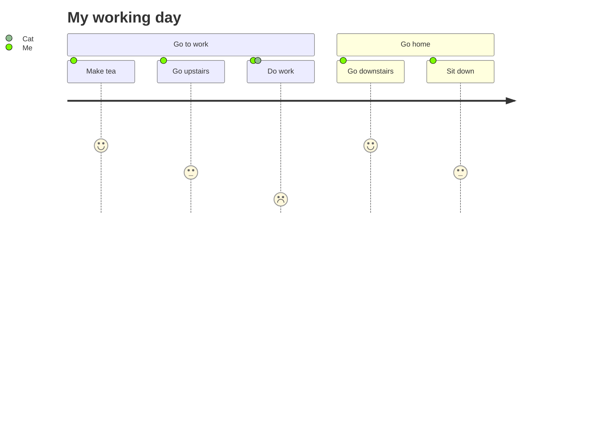

### XY座標圖

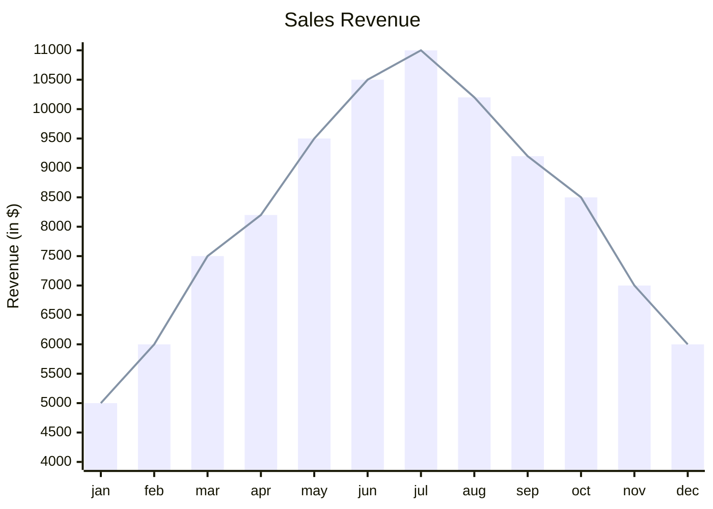

### Sankey圖

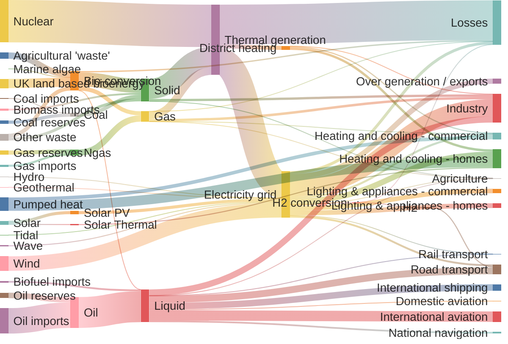

### KanBon 圖

```mermaid
kanban

Todo
  [Create Documentation]
  docs[Create Blog about the new diagram]
[In progress]
  id6[Create renderer so that it works in all cases. We also add som extra text here for testing purposes. And some more just for the extra flare.]
id9[Ready for deploy]
  id8[Design grammar]@{ assigned: 'knsv' }
id10[Ready for test]
  id4[Create parsing tests]@{ ticket: MC-2038, assigned: 'K.Sveidqvist', priority: 'High' }
  id66[last item]@{ priority: 'Very Low', assigned: 'knsv' }
id11[Done]
  id5[define getData]
  id2[Title of diagram is more than 100 chars when user duplicates diagram with 100 char]@{ ticket: MC-2036, priority: 'Very High'}
  id3[Update DB function]@{ ticket: MC-2037, assigned: knsv, priority: 'High' }

id12[Can't reproduce]
  id3[Weird flickering in Firefox]
```

### 架構圖


